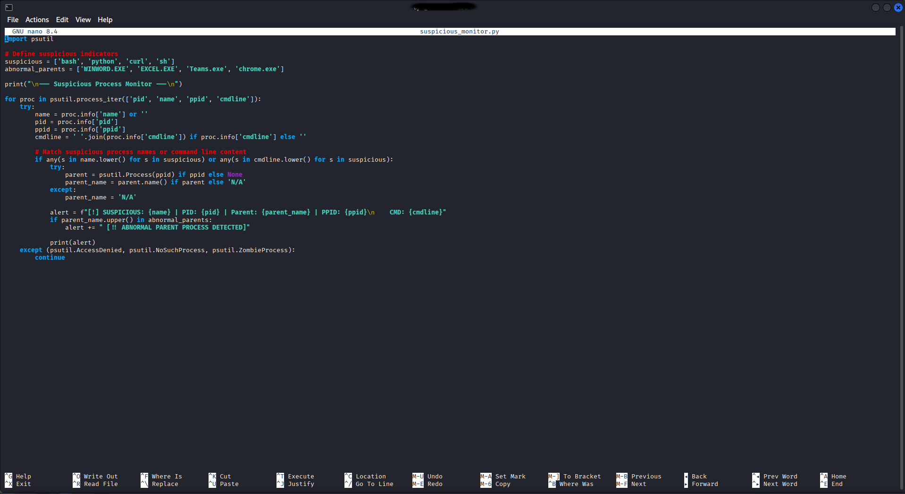
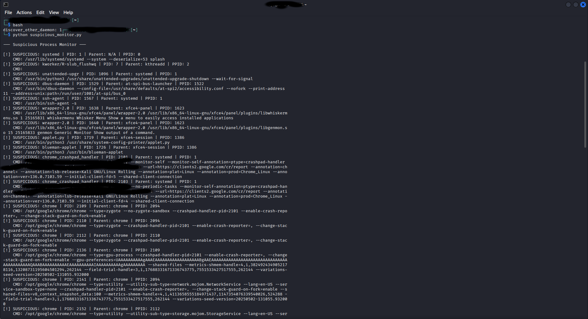
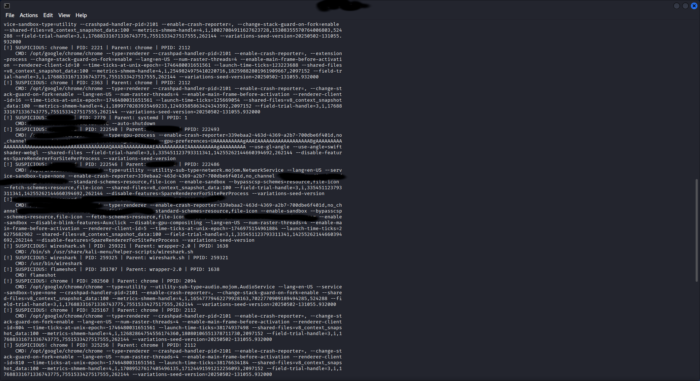
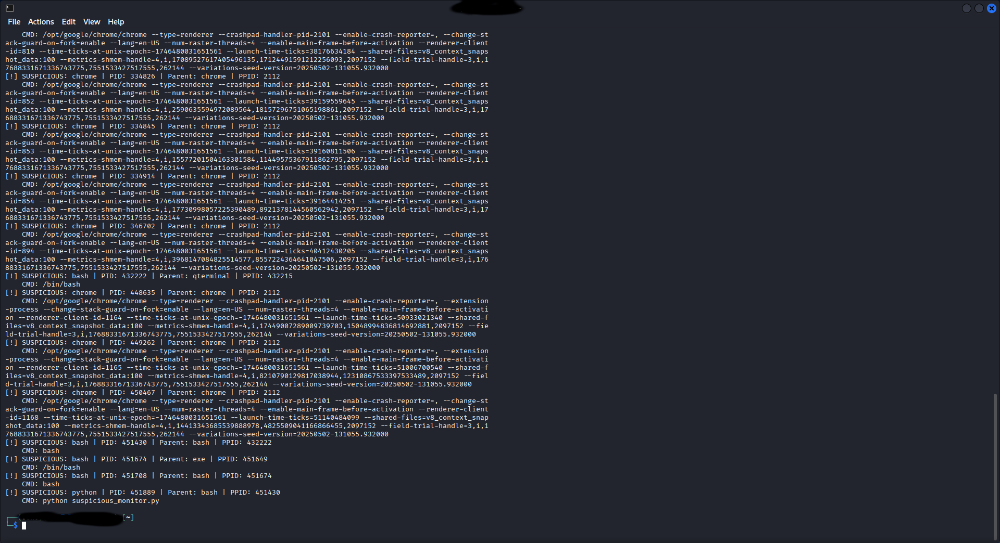

# Suspicious Process Monitor

This Python script scans all active processes on a Linux system using the `psutil` library. It flags known suspicious processes (e.g., bash, curl, python) and alerts when they are launched by abnormal parent processes like Word, Excel, or Chrome.

## 🔍 Features
- Detects suspicious commands and process names
- Flags unusual parent-child execution paths
- Prints process name, PID, parent name, and command line

## 📸 Screenshots
  
  
  


## 🛠 Usage
```bash
python suspicious_monitor.py
